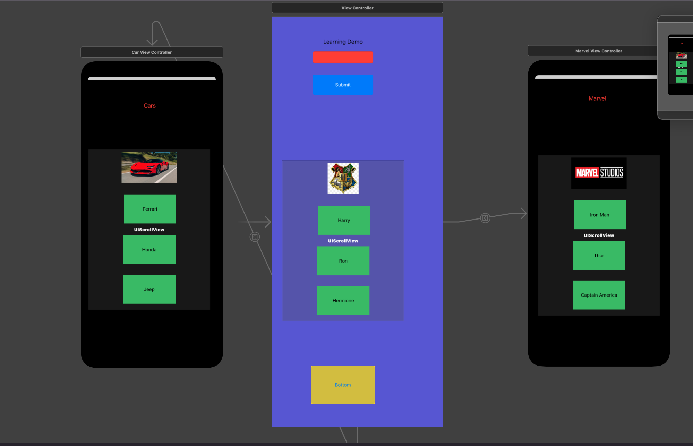

# XCUITestBasics
Basics of XCTest covering UI Testing using XCUITest and Unit Testing 

## Getting started
Extract the Learning.zip and launch the **Learning.xcodeproj**  
Build the project in your desired iOS and run the test cases
Use **Main.storyboard** to add UI elements and leverage them in the UI Tests available in LearningUITests folder
Use **UnitTests** folder for creating unit test cases for the individual classes

## Current Implementation in UI
The UI consists of the following elements
1. Learning Demo - label
2. Submit button - Triggers a Welcome alert box
3. Text field - to accept key board input
4. Harry , Ron , Hermione buttons - Triggers an action sheet displaying magic xp of each Hogwarts object
5. Swipe right and left for additional screens with additional buttons

